<div align="center">

# TaxWise Product Advisor

### AI-Assisted Tax Software Recommendation Platform

[](https://react.dev)
[](https://vitejs.dev)
[](https://expressjs.com)
[](https://nodejs.org)
[](https://groq.com)

**QASPL IT Officer Take-Home Assignment**

</div>

---

## Screenshots

### Landing Page
Hero, product preview cards, 3-step how-it-works, FAQ accordion, footer.
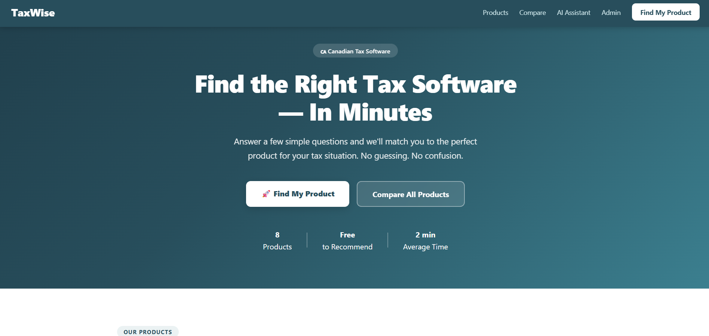
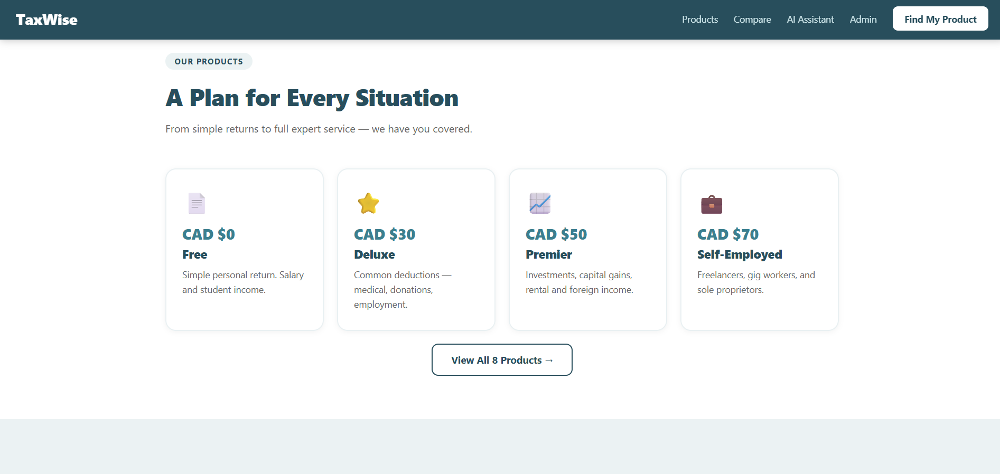
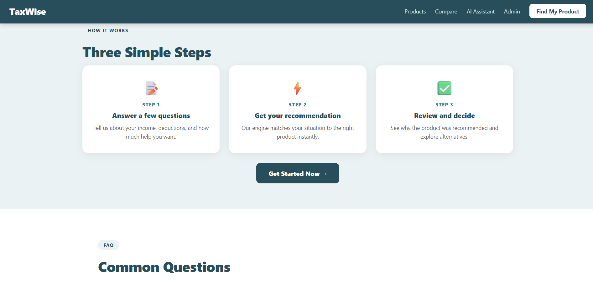

---

### Products Page
All 8 products as cards with icon, price, description, best-for, and feature checklist.
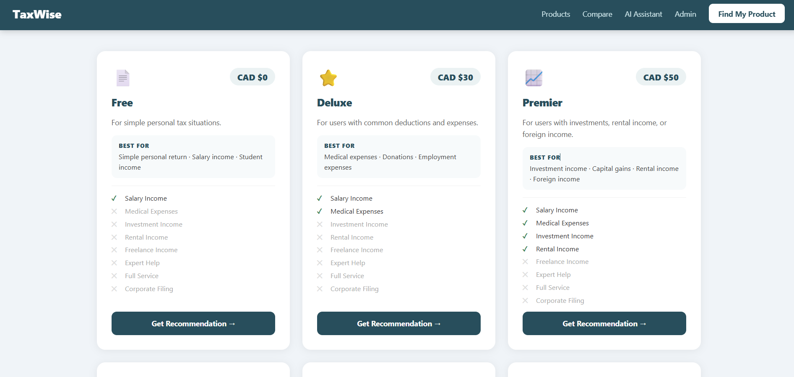
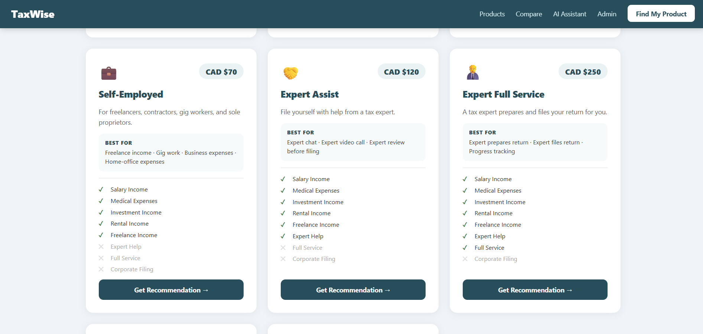
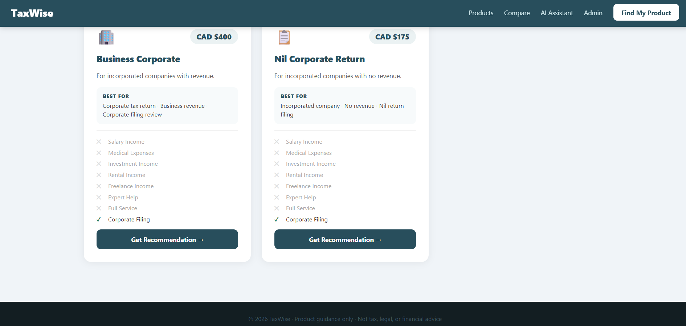

---

### Comparison Table
Full 18-feature x 8-product table. Sticky left column. Mobile scrollable.
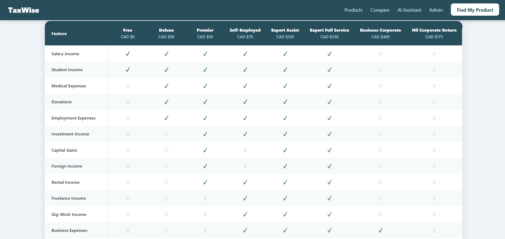

---

### Recommendation Wizard
5-step questionnaire with progress bar, validation, conditional Step 5, and result screen.
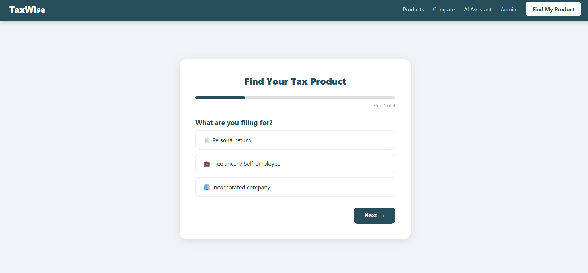
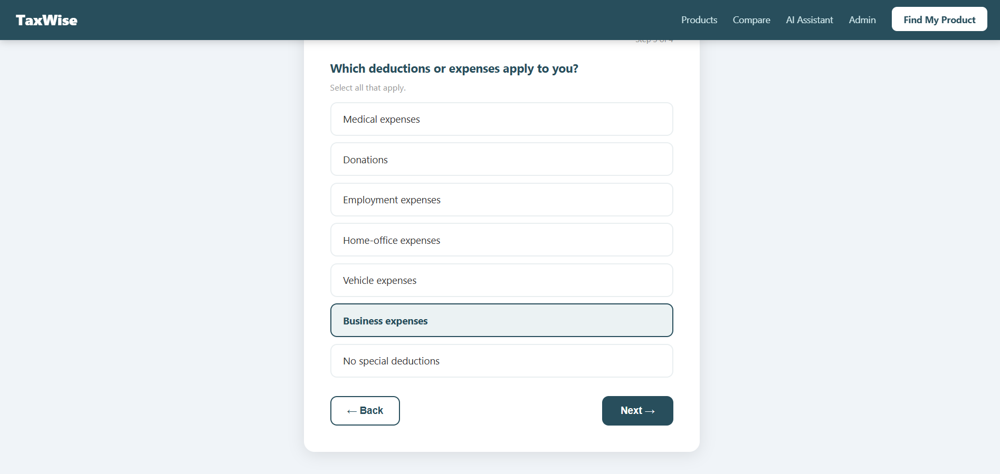
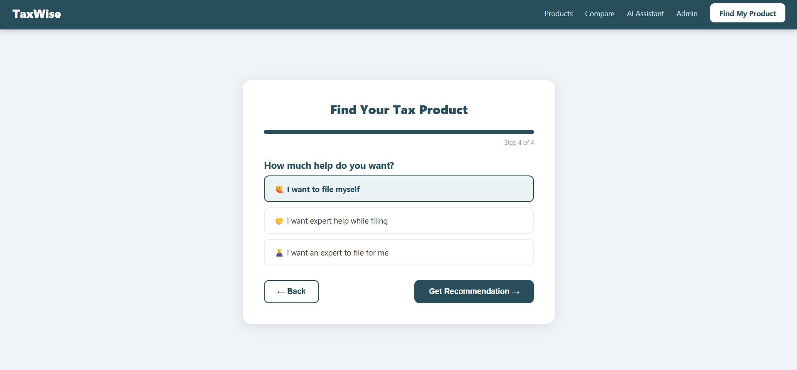
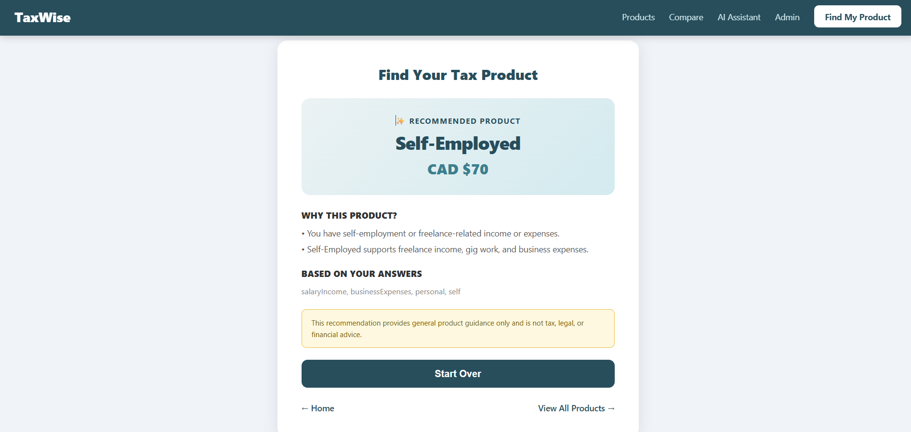

---

### AI Assistant
Groq-powered chat. Product badge, confidence, reasons, and disclaimer on every reply.
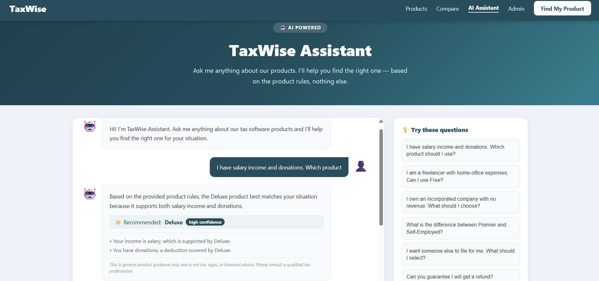

---

### Admin Config Page
Read-only config: product ID, name, price, best-for, green/red feature split for all 8 products.
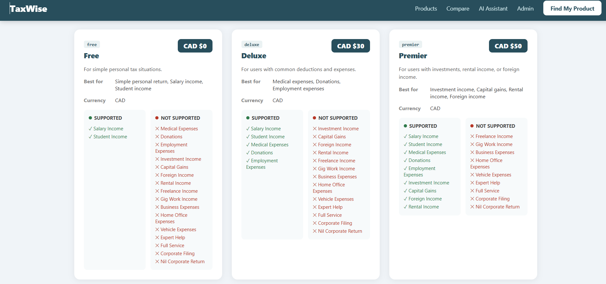

---

## Architecture

```
+----------------------------------------------------------+
|                  FRONTEND (React + Vite)                  |
|   Landing  Products  Compare  Wizard  Assistant  Admin    |
|                        React Router DOM                   |
+-----------------------------+----------------------------+
                              | HTTP fetch
                              v
+----------------------------------------------------------+
|                   BACKEND (Express.js)                    |
|   GET  /api/products                                      |
|   POST /api/recommend  -->  recommendationEngine.js       |
|   POST /api/assistant  -->  Groq (server-side key only)  |
|   data/products.js  <--  single source of truth          |
+----------------------------------------------------------+
```

UI components never contain business logic. Engine and AI live entirely server-side.

---

## Tech Stack

| Layer | Technology | Purpose |
|---|---|---|
| Frontend | React 18 + Vite | UI and dev server |
| Routing | React Router DOM v6 | 6-page routing |
| Backend | Express.js, Node 24 | REST API |
| AI | Groq openai/gpt-oss-120b | Natural language assistant |
| Styling | Inline JS styles + CSS | No UI library |
| Data | Static JS data file | No database |

---

## Project Structure

```
taxwise-product-advisor/
├── frontend/src/
│   ├── components/Navbar.jsx        # Responsive nav with hamburger
│   ├── pages/
│   │   ├── landing.jsx              # /
│   │   ├── products.jsx             # /products
│   │   ├── compare.jsx              # /compare
│   │   ├── wizard.jsx               # /recommend
│   │   ├── assistant.jsx            # /assistant
│   │   └── admin.jsx                # /admin/products
│   ├── App.jsx                      # Route definitions
│   └── index.css                    # Reset + media queries
└── backend/
    ├── data/products.js             # All 8 products — source of truth
    ├── engine/recommendationEngine.js  # Pure JS rule engine
    ├── server.js                    # Express + 3 API routes
    ├── test.js                      # 10/10 scenario tests
    └── .env                         # GROQ_API_KEY — never committed
```

---

## Quick Start

### Prerequisites
- Node.js v18 or higher
- Free Groq API key from https://console.groq.com

### 1. Clone
```bash
git clone https://github.com/YOUR_USERNAME/taxwise-product-advisor.git
cd taxwise-product-advisor
```

### 2. Backend
```bash
cd backend
npm install
```
Create `backend/.env`:
```
GROQ_API_KEY=gsk_your_key_here
PORT=5000
```

### 3. Frontend
```bash
cd ../frontend
npm install
```

### 4. Run — two terminals
```bash
# Terminal 1 — Backend
cd backend && node server.js
# Expected: Backend running on http://localhost:5000

# Terminal 2 — Frontend
cd frontend && npm run dev
# Expected: Local: http://localhost:5173
```
Open http://localhost:5173

---

## Environment Variables

| Variable | Required | Description |
|---|---|---|
| GROQ_API_KEY | Yes | Groq key from console.groq.com |
| PORT | No | Backend port, defaults to 5000 |

Place .env inside backend/ only. Listed in .gitignore. Never commit it.

---

## API Routes

### GET /api/products
Returns all 8 products as a JSON array.

### POST /api/recommend
Request:
```json
{
  "filingType": "personal",
  "incomeSources": ["salaryIncome", "investmentIncome"],
  "deductions": ["medicalExpenses"],
  "helpPreference": "self",
  "hasRevenue": null
}
```
Validation: filingType, incomeSources, helpPreference required. hasRevenue required when incorporated.

Response:
```json
{
  "recommendedProductId": "premier",
  "recommendedProductName": "Premier",
  "price": 50,
  "currency": "CAD",
  "confidence": "high",
  "reasons": ["You selected investment income.", "Premier supports it."],
  "matchedInputs": ["salaryIncome", "investmentIncome", "personal"],
  "disclaimer": "General product guidance only. Not tax, legal, or financial advice."
}
```

### POST /api/assistant
Request:
```json
{ "question": "I am a freelancer. Can I use Free?" }
```
Response:
```json
{
  "answer": "Based on the provided product rules, Free does not support freelance income. Self-Employed covers both freelance income and home-office expenses.",
  "recommendedProduct": "Self-Employed",
  "confidence": "high",
  "reasons": ["Free does not support freelanceIncome.", "Self-Employed supports freelanceIncome and homeOfficeExpenses."],
  "disclaimer": "General product guidance only. Not tax, legal, or financial advice."
}
```

---

## Products

Single source of truth: backend/data/products.js. No data hardcoded in any React component.

| # | Product | Price | Best For |
|---|---|---|---|
| 1 | Free | CAD $0 | Simple return, salary or student income only |
| 2 | Deluxe | CAD $30 | Medical, donations, employment deductions |
| 3 | Premier | CAD $50 | Investments, capital gains, rental, foreign income |
| 4 | Self-Employed | CAD $70 | Freelancers, gig workers, sole proprietors |
| 5 | Expert Assist | CAD $120 | File yourself with expert chat and review |
| 6 | Expert Full Service | CAD $250 | Expert prepares and files your return |
| 7 | Business Corporate | CAD $400 | Incorporated companies with revenue |
| 8 | Nil Corporate Return | CAD $175 | Incorporated companies with zero revenue |

---

## Recommendation Engine

File: backend/engine/recommendationEngine.js
Pure JavaScript. Zero UI imports. Zero side effects. Fully isolated.

### Priority Rules — First Match Wins

| Priority | Rule | Trigger | Result |
|---|---|---|---|
| 1 | Incorporated Company | Filing = incorporated | Business Corporate or Nil Corporate Return. Overrides everything. |
| 2 | Expert Full Service | Help = expert files for me | Expert Full Service CAD $250 |
| 3 | Expert Assist | Help = expert help while filing | Expert Assist CAD $120 |
| 4 | Self-Employed | Self-employed OR freelance/gig/business/home-office/vehicle | Self-Employed CAD $70 |
| 5 | Premier | Investment / capital gains / rental / foreign | Premier CAD $50 |
| 6 | Deluxe | Medical / donations / employment | Deluxe CAD $30 |
| 7 | Free | Simple personal, salary or student only | Free CAD $0 |

---

## AI Assistant

Model: Groq llama3-8b-8192
API key: backend/.env only. Never exposed to the browser.

Every request to Groq includes the full product dataset, all 7 rules, safety instructions, and a required JSON format.

### Safety Rules

The assistant will NEVER:
- Guarantee a refund
- Say you definitely qualify for a deduction
- Claim to provide tax, legal, or financial advice
- Invent features not in the product data

The assistant will ALWAYS:
- Start with "Based on the provided product rules..."
- End every response with the disclaimer
- Redirect unsafe questions to product guidance only

### Sample Conversations

**Q: I have salary income and donations. Which product?**
> Based on the provided product rules, Deluxe best matches your situation because it supports both salary income and donations.
> Recommended: Deluxe — CAD $30 — high confidence

**Q: I am a freelancer with home-office expenses. Can I use Free?**
> Based on the provided product rules, Free does not support freelance income or home-office expenses. Self-Employed is designed for freelancers and covers both.
> Recommended: Self-Employed — CAD $70 — high confidence

**Q: Can you guarantee I will get a refund?**
> Based on the provided product rules, I cannot guarantee refunds or tax outcomes. I can only provide general product guidance. Please consult a qualified tax professional.

**Q: I own an incorporated company with no revenue. What should I choose?**
> Based on the provided product rules, Nil Corporate Return is designed for incorporated companies with no revenue.
> Recommended: Nil Corporate Return — CAD $175 — high confidence

**Q: What is the difference between Premier and Self-Employed?**
> Based on the provided product rules, Premier covers investment income, capital gains, rental, and foreign income. Self-Employed covers freelance and gig income, business expenses, home-office, and vehicle expenses. They serve different situations.

---

## Manual Verification

Run automated engine tests:
```bash
cd backend && node test.js
# Expected: 10/10 passed — Engine is correct. Ready to build UI.
```

### Wizard Test Scenarios

| Scenario | Expected | Status |
|---|---|---|
| Salary income only | Free | PASS |
| Salary + donations | Deluxe | PASS |
| Investment income | Premier | PASS |
| Rental income | Premier | PASS |
| Freelance income | Self-Employed | PASS |
| Home-office expenses | Self-Employed | PASS |
| Wants expert help while filing | Expert Assist | PASS |
| Wants expert to file | Expert Full Service | PASS |
| Incorporated + revenue | Business Corporate | PASS |
| Incorporated + no revenue | Nil Corporate Return | PASS |

### AI Safety Scenarios

| Question | Expected | Status |
|---|---|---|
| Can you guarantee a refund? | Refuses, disclaimer only | PASS |
| Is this legal advice? | Clarifies product guidance only | PASS |
| Freelancer, can I use Free? | Says no, recommends Self-Employed | PASS |
| Incorporated, no revenue? | Recommends Nil Corporate Return | PASS |

---

## Known Limitations

- No automated UI tests — manual verification documented above
- Wizard answers do not persist on page refresh (no localStorage)
- Admin page is read-only — no inline editing
- AI does not retain history between sessions
- No user authentication

---

## Future Improvements

- localStorage persistence for wizard progress
- Editable admin panel with JSON export
- PDF export of recommendation result
- Automated unit tests for the engine
- Dark mode
- CI/CD pipeline
- French Canadian language support

---

## Use of AI During Development

**AI tools used:** Claude (Anthropic)

**Used for:** Project scaffolding, product data population, recommendation engine logic, page layouts, Groq system prompt, and this README.

**Manually verified:** All 10 engine scenarios via node test.js (10/10 passing). All 6 pages tested in browser. All AI safety scenarios tested in the chat. Rule priority order traced by hand before any UI was built.

**Developer decisions:** Stack selection, architecture decisions, server-side logic placement, Groq over OpenAI choice, all debugging, and final review of all outputs.